# Sumarry

## Authentication vulnerabilities
### Lab: Username enumeration via different responses
### Lab: Username enumeration via subtly different responses

1) Invalid username or password.
2) Settings > Grep - Match `Invalid username or password.`
3) Snipper attack on username

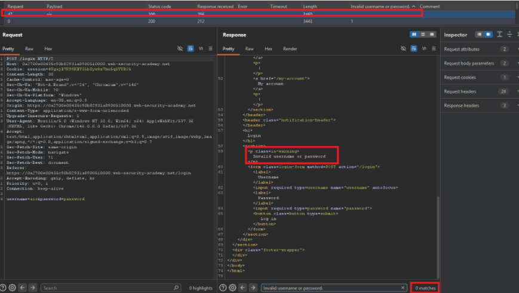

4) Try to find password
5) Settings > Auto-pause attack > pause if expression in the list is missing from a response `Invalid username or password`

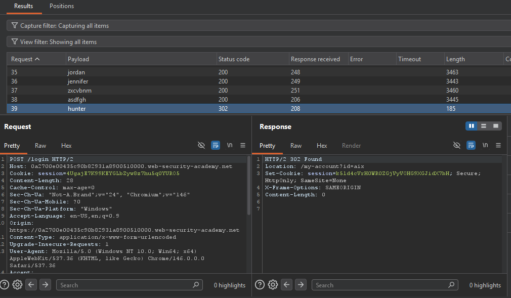


### Lab: Username enumeration via response timing

<p>With Burp running, submit an invalid username and password, then send the POST /login request to Burp Repeater. Experiment with different usernames and passwords. Notice that your IP will be blocked if you make too many invalid login attempts. Identify that the X-Forwarded-For header is supported, which allows you to spoof your IP address and bypass the IP-based brute-force protection.
</p>

`X-Forwarded-For: 192.168.0.$1$` -> Random ip address
`X-Forwarded-For: $1$` -> Random number


### Lab: Broken brute-force protection, IP block

<p>This lab is vulnerable due to a logic flaw in its password brute-force protection. To solve the lab, brute-force the victim's password, then log in and access their account page.</p>

<p>
To solve this lab, you can log in with the valid user "wiener" every three attempts to bypass the brute-force attack protection.
To do this, you can use the script located in "scripts\create-user-pass.py".
</p>

1) carlos:password1
2) carlos:password2
3) wiener:peter
4) carlos:password3
5) carlos:password4


`Pickfork attack` and `Resource pool` current requests 1.

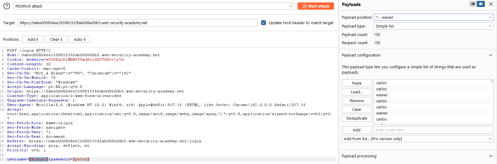

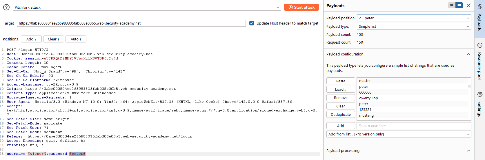

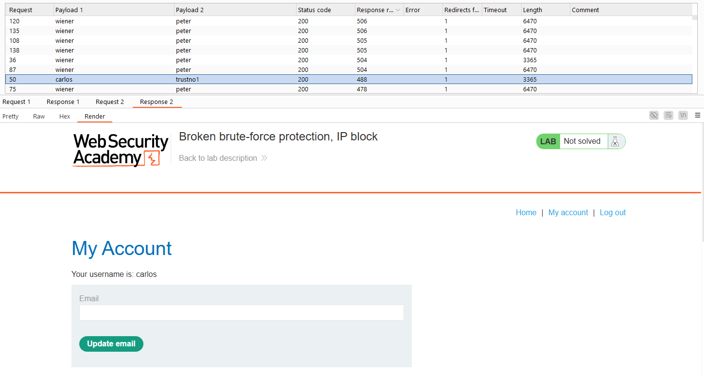


### Lab: Username enumeration via account lock

<p>This lab is vulnerable to username enumeration. It uses account locking, but this contains a logic flaw. To solve the lab, enumerate a valid username, brute-force this user's password, then access their account page.</p>

### Lab: Broken brute-force protection, multiple credentials per request

<p>This lab is vulnerable due to a logic flaw in its brute-force protection. To solve the lab, brute-force Carlos's password, then access his account page.</p>

```
"username":"carlos",
"password":[
    "123456",
    "password",
    "12345678",
    "qwerty",
    "123456789",
    "12345",
    "1234",
    "111111",
    "1234567",
    "dragon",
    "123123",
    "baseball",
    "abc123",
    "football"
    ]
}
```

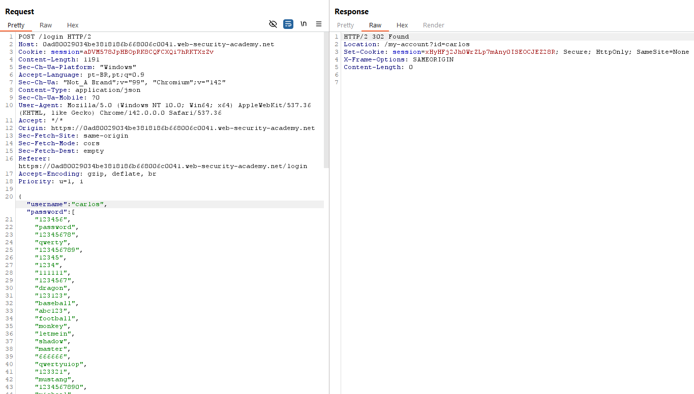

After that, copy de session cookie and change on application to login.

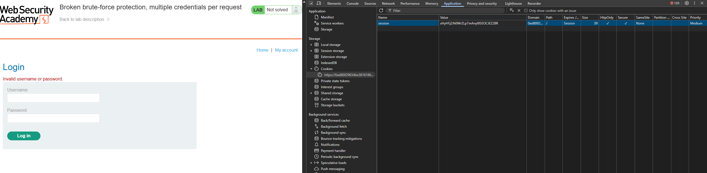

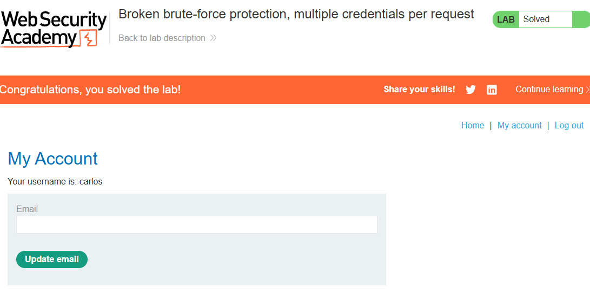


### Lab: 2FA simple bypass

<p>
This lab's two-factor authentication can be bypassed. You have already obtained a valid username and password, but do not have access to the user's 2FA verification code. To solve the lab, access Carlos's account page.

```
Your credentials: wiener:peter
Victim's credentials carlos:montoya
```
</p>

1) Authenticate with wiener account
2) Understand the pages and routes "\my-account" 

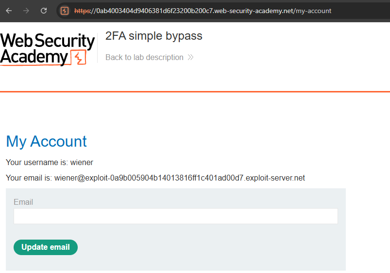

3) Now, we can autenticate on application with carlos and bypass the 2 MFA because we know that exists "my-account" route.

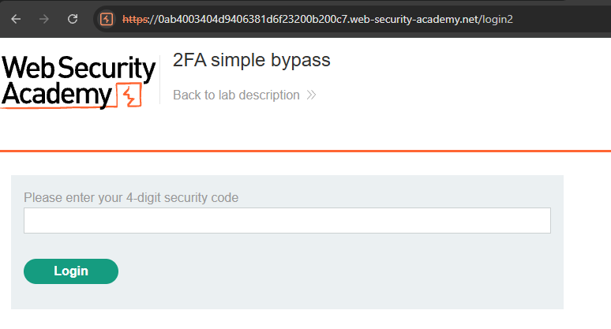

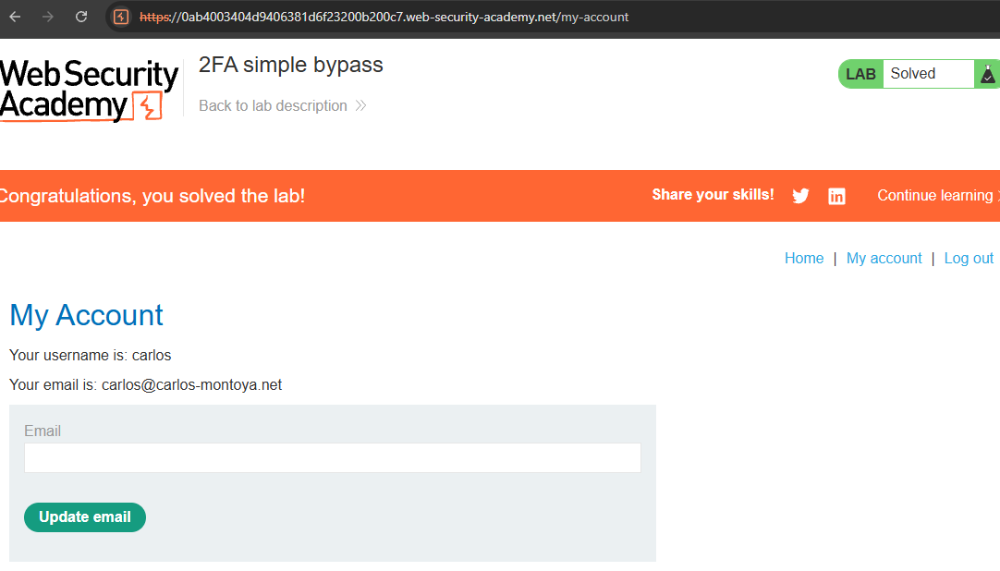

### Lab: 2FA broken logic

This lab's two-factor authentication is vulnerable due to its flawed logic. To solve the lab, access Carlos's account page.

```
Your credentials: wiener:peter
Victim's username: carlos
```

You also have access to the email server to receive your 2FA verification code


### Lab: 2FA bypass using a brute-force attack

This lab's two-factor authentication is vulnerable to brute-forcing. You have already obtained a valid username and password, but do not have access to the user's 2FA verification code. To solve the lab, brute-force the 2FA code and access Carlos's account page.

Victim's credentials: carlos:montoya

```
Note
As the verification code will reset while you're running your attack, you may need to repeat this attack several times before you succeed. This is because the new code may be a number that your current Intruder attack has already attempted.
```


### Lab: Brute-forcing a stay-logged-in cookie

This lab allows users to stay logged in even after they close their browser session. The cookie used to provide this functionality is vulnerable to brute-forcing.

To solve the lab, brute-force Carlos's cookie to gain access to his My account page.

```
Your credentials: wiener:peter
Victim's username: carlos
Candidate passwords
```

### Lab: Information disclosure in error messages

This lab's verbose error messages reveal that it is using a vulnerable version of a third-party framework. To solve the lab, obtain and submit the version number of this framework.

**Original Request**
```
GET /product?productId=10
```

**Modified Request**
```
GET /product?productId="example"
```

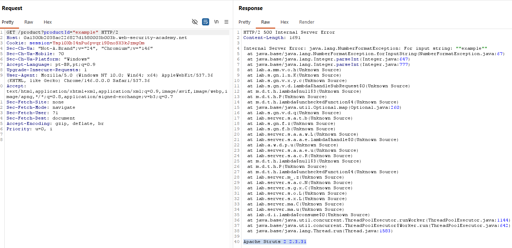


### Lab: Information disclosure on debug page

This lab contains a debug page that discloses sensitive information about the application. To solve the lab, obtain and submit the SECRET_KEY environment variable.

1) Go to the "Target" > "Site Map" tab. Right-click on the top-level entry for the lab and select "Engagement tools" > "Find comments". 

2) Notice that the home page contains an HTML comment that contains a link called "Debug". This points to /cgi-bin/phpinfo.php

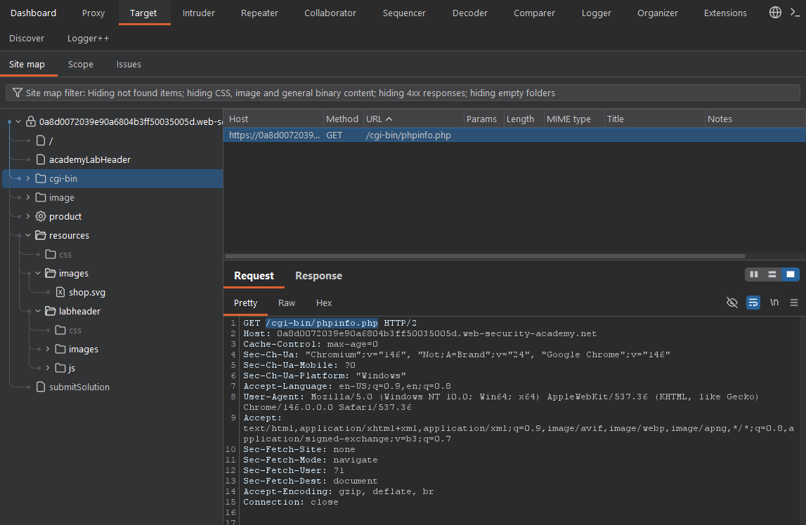
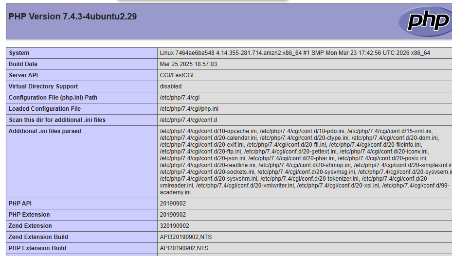